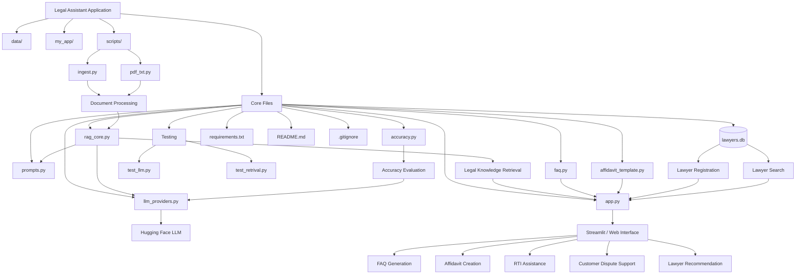

# ⚖️ LegiSense – AI-Powered Legal Aid Advisor  

## 📖 Overview  
**LegiSense** is an **AI-powered legal assistance platform** that makes legal help more **accessible, affordable, and efficient**.  
It combines **automation, AI, and law** into a single, easy-to-use application.  


## 🚀 Tech Stack

### 🖥️ Frontend


### 🧠 AI / ML


### 📄 Document & Data Processing


### 🗄️ Database


### ⚙️ Utilities


## Architecture

---

## 🔑 Features  
- 🤖 **Legal Chatbot** – Provides instant answers to basic legal queries using NLP.  
- 📄 **Affidavit Generator** – Automatically generates structured affidavits.  
- 📝 **RTI & Consumer Dispute Generator** – Helps draft RTI applications & consumer complaints.  
- 📚 **Legal Summarizer** – Summarizes long legal documents into concise insights.  
- 👨‍⚖️ **Lawyer Directory** –  
  - Lawyers can **register** with details (specialization, experience, fees, location).  
  - Clients can **search & connect** with filters like specialization, fees, experience, rating.  

---

## 🛠️ Tech Stack  
- **Frontend / UI**: [Streamlit](https://streamlit.io/)  
- **Database**: [SQLite](https://www.sqlite.org/index.html)   
- **Version Control & Collaboration**: [GitHub](https://github.com/) 

---

## 🚀 Getting Started  

### Clone the Repository  
```bash
git clone https://github.com/your-username/LegiSense.git
```
### Set Up Virtual Environment
```
python -m venv venv
source venv/bin/activate   # On Mac/Linux
venv\Scripts\activate
```
### Install Dependencies
```
pip install -r requirements.txt
```

### Run the App
```
streamlit run my_app/streamlit_app.py
```
## 🌍 Vision

LegiSense aims to bridge the gap between citizens and legal help by combining AI automation with expert legal knowledge, empowering individuals to get the right assistance without unnecessary hurdles.

## 🌐 Connect with Me  and My team 
  
Meet the amazing team behind **LegiSense** 🚀  

| Name            | Role                          | LinkedIn |
|-----------------|-------------------------------|----------|
| Kashish Rana    | App Deployment                | [](https://www.linkedin.com/in/kashish-rana-6116691b5/) |
| Rahul Manchanda | Backend & Model Training      | [](https://www.linkedin.com/in/rahul-manchanda-3959b120a/) |
| Tanishka Mukhi  | Data Preprocessing & Collection | [](https://www.linkedin.com/in/tanishka-mukhi09/) |


---


